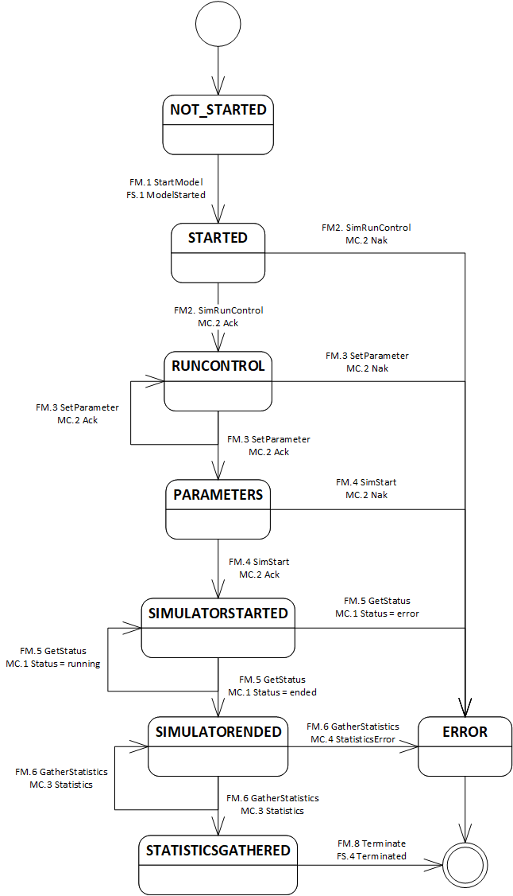

# FM: Federation Manager

The Federation Manager is responsible for the management of the execution of one or more models. It asks the Federate Starter to start models on its behalf on other servers (or could do so itself if all models run on the same computer). A set of messages has been devised to communicate with one or more Federate Starters on multiple computers to start models, and to communicate with the models to set the parameters and experimental conditions, and to gather the statistics afterward. Multiple Federation Managers can work in parallel and communicate with their own set of models. 


## Java reference implementation

In the sim0mq-demo project, an example of the parallel execution of 20 replications of a model with different seeds is provided. The way that this is often done is by using a **state machine** that represents the successive states of the execution of each model (so when 20 models are running, 20 state machines are active). In the reference demo implementation, the state machine has the following state transitions:



It has been implemented as follows:

```java
    static class StateMachine
    {
        private ModelState state; // the current state
        private ZMQ.Socket modelSocket; // socket of the ModelControl
        private String modelName;
        private ZMQ.Socket fsSocket; // socket of the FederateStarter
        private ZContext fmContext; // ctx variable
        private AtomicLong messageCount;
        private Map<String, Number> statistics = new HashMap<>(); // statistics

        StateMachine(final AtomicLong messageCount, final String federationName, final int fsPort, final String localSk3,
                final int modelNr) throws Sim0MQException, SerializationException
        {
            this.fmContext = new ZContext(1);

            this.fsSocket = this.fmContext.createSocket(SocketType.REQ);
            this.fsSocket.setIdentity(UUID.randomUUID().toString().getBytes());

            this.modelName = "MM1." + modelNr;
            this.messageCount = messageCount;

            this.modelSocket = this.fmContext.createSocket(SocketType.REQ);
            this.modelSocket.setIdentity(UUID.randomUUID().toString().getBytes());

            this.state = ModelState.NOT_STARTED;
            boolean ready = false;
            while (!ready)
            {
                switch (this.state)
                {
                    case NOT_STARTED:
                        startModel(federationName, fsPort, localSk3);
                        break;

                    case STARTED:
                        sendSimRunControl(federationName);
                        break;

                    case RUNCONTROL:
                        setParameters(federationName);
                        break;

                    case PARAMETERS:
                        sendSimStart(federationName);
                        break;

                    case SIMULATORSTARTED:
                        waitForSimEnded(federationName);
                        break;

                    case SIMULATORENDED:
                        requestStatistics(federationName);
                        break;

                    case STATISTICSGATHERED:
                        killFederate(federationName);
                        ready = true;
                        break;

                    case ERROR:
                        killFederate(federationName);
                        ready = true;
                        break;

                    default:
                        break;
                }
            }

            this.fsSocket.close();
            this.modelSocket.close();
            this.fmContext.destroy();
            this.fmContext.close();
        }
```

where the ModelState is an enum:

```java
public enum ModelState
{
    /** Model has not yet been started. */
    NOT_STARTED,

    /** Model has been started, e.g. bij a FederateStarter. */
    STARTED,

    /** SimRunControl has been sent. */
    RUNCONTROL,

    /** Parameter(s) have been sent. */
    PARAMETERS,

    /** Simulator has been started. */
    SIMULATORSTARTED,

    /** Simulator has ended. */
    SIMULATORENDED,

    /** Statistics have been gathered. */
    STATISTICSGATHERED,

    /** Model terminated. */
    TERMINATED,

    /** Error occurred. Sequence should stop. */
    ERROR;
```

The StateMachine moves each model through the successive states and asks at the end, when statistics have been gathered, to the FederateStarter to terminate the model and clean up the output and error files.

Each of the 20 state machine instances is started in a thread:

```java
        AtomicLong messageCount = new AtomicLong(0L);
        AtomicInteger nrRunning = new AtomicInteger();
        Map<Integer, Map<String, Number>> statMap = Collections.synchronizedMap(new HashMap<Integer, Map<String, Number>>());
        for (int modelNr = 0; modelNr < 20; modelNr++)
        {
            new Thread()
            {
                @Override
                public void run()
                {
                    final int nr = nrRunning.getAndIncrement();
                    StateMachine stateMachine = null;
                    try
                    {
                        stateMachine = new StateMachine(messageCount, federationName, fsPort, localSk3, nr);
                    }
                    catch (Sim0MQException | SerializationException exception)
                    {
                        exception.printStackTrace();
                    }
                    int decNr = nrRunning.decrementAndGet();
                    synchronized (statMap)
                    {
                        statMap.put(nr, stateMachine.getStatistics());
                    }
                }
            }.start();
        }
```

The state machine does not return until the model has finished, or the model run has terminated with an error. The `synchronized` statistics map is meant to store the results of each replication so they can be averaged over the 20 replications.
