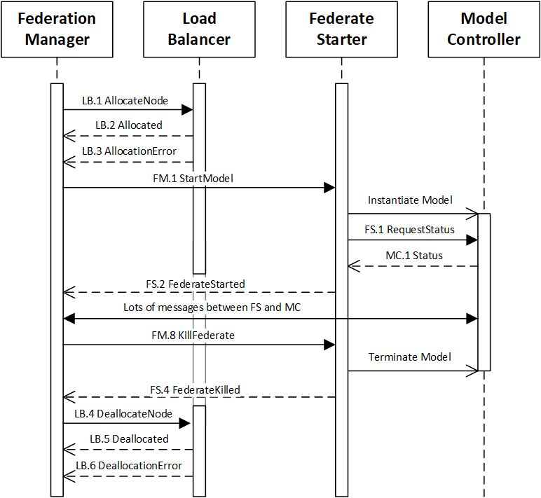

# LB: Load Balancer (v2)

The Load Balancer (LB; sim0mq version 2) sits between the Federation Manager (FM) or Web Server (WS) and the Federate Starter (FS). Instead of starting a single Federate Starter directly from a Federation Manager, it asks the Load Balancer component which preferred node is least busy. After receiving the answer, the FM will then contact the FS on that particular node. 

The load balancing logic is kept in a separate component because:
1. Not all federations need a load balancer, so forcing the implementation of the LB services on each FM is quite an overhead.
2. Load balancing could involve starting or creating extra nodes in the cloud, or scaling down the number of nodes, e.g., through Kubernetes. In such a scenario, the Load Balancer also provides the interface to Kubernetes or another cloud node manager, which we do not want to put into the Web Server or the Federation Manager (separation of concerns). 

The Load Balancer should **not** be iinvolved in the actual starting of the model through the Federate Starter, just in the allocation and deallocation of capacity on the execution nodes. The Load Balancer **just** does the housekeeping of the available and used capacity of the nodes (and in case we have dynamic nodes, ensures that the available number of nodes is scaled up and down appropriately).

The interaction between FM, LB, FS, and MC works roughly as follows:




## Reference implementation

A reference implementation of a simple Load Balancer (class SimpleLoadBalancer.java) has been made. The LoadBalancer uses a table in a file that has the following columns:

* **IPName**: The name or ip-address of the node/server to be used.
* **FSPort**: The port of the FederateStarter on that particular node.
* **Priority**: The priority class for the node; higher means higher priority.
* **MaxProcesses**: The maximum number of concurrent models to run on the node.
* **MaxMemory**: The maximum amount of memory to use on that node, indicated as a number, with optional kB, MB, GB, TB.

An example of such a table is given below:

```xml
IPName         FSPort Priority  MaxProcesses  MaxMemory
130.161.3.179   5500      10        10          100G
130.161.3.180   5500      10        16          200G
194.168.8.120   5500       5         5           16G
194.168.8.121   5500       5         5           16G
194.168.8.122   5500       5         5           16G
194.168.8.123   5500       5         5           16G
100.50.161.224  5500       1        20          256G
100.50.161.225  5500       1        20          256G
```

The LoadBalancer allocates processes on nodes _per priority category_, and only moves to a lower priority category when a higher priority category is completely full. It tries to balance the processes within the same priority category to allow for maximum distribution and speed within that priority category. It determines how full a node is by looking at two parameters: number of running processes, and use of memory. It considers the node/server to be full when either of the limits is met. 

In the example above this means that the 194.168-nodes are only used when 26 processes are running on the 130.161-nodes, or when the 300 GB of memory on these two nodes has been filled. The bottom two 100.50-servers could be 'failover' servers that are only used when all other servers are full, e.g., because they cost money.

!!! Warning
    Remember to start the processes via the FederateStarter with the same memory limits that were given to the LoadBalancer. For Java processes this means that they should be started with the -Xmx parameter, e.g., `-Xmx500M` if the `LB.1 AllocateNode` message used 500 MB as the needed memory for the process.


## Reference implementation in Java

TODO


