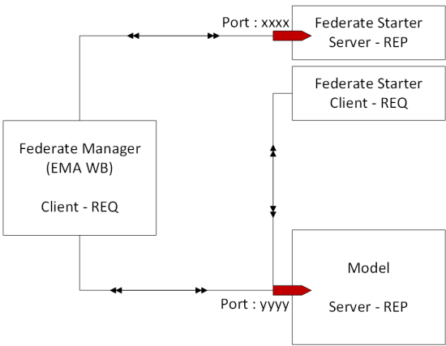
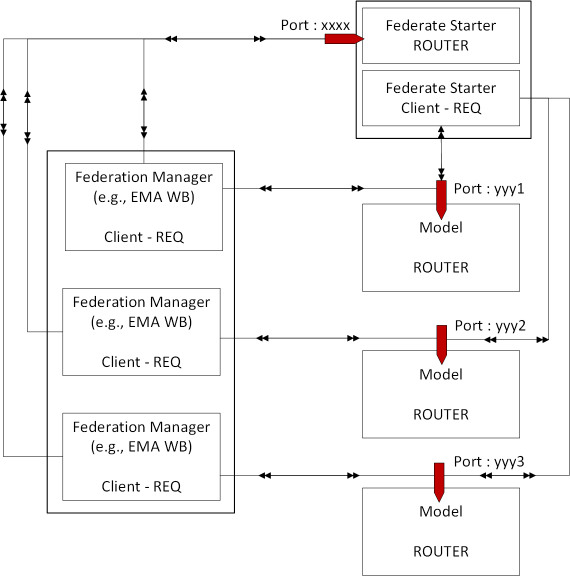

# 0MQ Interaction Patterns

## REQ - REP pattern

The simplest pattern in 0MQ is REQ-REP (request - reply). 



When we would use that for the exchange, the problem would be that the Model Controller gets commands from both the Federation Manager and the Federate Starter. This is not possible with REQ-REP. therefore we need a more extensive pattern that is explained in the next section.


## REQ-ROUTER pattern

In the figure above, it was shown that both the Federation Manager and the Federate Starter communicate with the Model. This cannot be done with a REQ-REP framework, as REQ-REP is a 1:1 connection. Instead, the model can implement a ROUTER socket, which allows multiple connections. The ROUTER socket is a bit more complicated, however. 

The following logic has to be implemented in the model:

* Each client should have a unique identity. This is done with the socket.setIdentity(String identity) method in the [Federation Manager](https://sim0mq.org/manual/2-components/federation-manager) and the Federate Starter, right after the socket has been created, and before binding to a port. In the reference implementation, a unique UUID is generated for each identity.
* The model should use the identity to talk back to the clients, so it will use the right channel.
* The model is a bit more complicated in terms of communication, as it explicitly receives the identity and the envelope separator (the REP receives these fields as well, but strips the identity and separator from the message so the Model Controller does not have to act on it).

The communication takes place as follows:

```
Model (ROUTER)                FS/FM Client (REQ)
socket(ZMQ.ROUTER)            socket(ZMQ.REQ)
setIdentity(String uniqueId)
recv(identity)         <----- sendMessage
recv(delimiter)
recv(message)
    [process the data]
sendMore(identity)
sendMore(delimiter)
send(reply_message)    -----> recv
```

The connections with the REQ-ROUTER pattern are given in the Figure below:




## Java code for the REQ-ROUTER interaction

### Initialization on the REQ side

Initializing the sockets is e.g., done as follows (example for the Federation Manager). A contet is created with 1 I/O thread (sufficient for a reasonable number of clients). After that, the sockets to talk to the Federate Starter and to the Model Controller are created. Each gets a unique identity, which willl be used in subsequent message exchanges to separate the discussions that take place via the same port from each other.

```java
    ZContext fmContext = new ZContext(1);

    ZMQ.Socket fsSocket = fmContext.createSocket(SocketType.REQ);
    fsSocket.setIdentity(UUID.randomUUID().toString().getBytes());
    fsSocket.connect("tcp://127.0.0.1:" + fsPort);

    ZMQ.Socket modelSocket = fmContext.createSocket(SocketType.REQ);
    modelSocket.setIdentity(UUID.randomUUID().toString().getBytes());
    modelSocket.connect("tcp://127.0.0.1:" + modelPort);
```

### Initialization on the ROUTER side

On the router-side, e.g. at the Model Controller, the sockets are initialized as folllows. The port is an int that indicates on what port the Model Controller is listening to the Federate Starter and the Federation Manager.

```java
    ZContext modelContext = new ZContext(1);
    ZMQ.Socket listeningSocket = modelContext.createSocket(SocketType.ROUTER);
    listeningSocket.bind("tcp://*:" + port);
```

### Sending a message and waiting for the reply

As an example, see the Java code for sending a "start simulator" message (FM.4) to a model and waiting for the "ack/nak" message (MC.2) to arrive as a reply:

```java
    long messageNumber = this.messageCount.get();
    byte[] fm4Message;
    fm4Message = SimulationMessage.encodeUTF8(federationName, "FM", this.modelName, "FM.4",
            this.messageCount.getAndIncrement(), MessageStatus.NEW);
    this.modelSocket.send(fm4Message);

    byte[] reply = this.modelSocket.recv(0);
    Object[] replyMessage = SimulationMessage.decode(reply);
```

where messageCount is a `private AtomicLong messageCount;`. On the other side, the Model Controller waits for a message such as FM.4:

```java
    // Wait for next request from the client -- first the identity (String) and the delimiter (#0)
    String identity = this.fsSocket.recvStr();
    this.fsSocket.recvStr();

    byte[] request = this.fsSocket.recv(0);
    Object[] fields = SimulationMessage.decode(request);

    this.federationRunId = fields[1];
    String senderId = fields[2].toString();
    String receiverId = fields[3].toString();
    String messageId = fields[4].toString();
    long uniqueId = ((Long) fields[5]).longValue();

    if (receiverId.equals(this.modelId))
    {
        if (messageId.equals("FM.4"))
                processSimStart(identity, senderId, uniqueId);
    }
```

with the following method for `processSimStart`, which simitializes a DSOL model with a replication, and schedules a method called 'terminate' at simulation time 100.0. After that, the simulation replication is started. An MC.2 message (ack/nak) is sent back as an answer after the (un)successful start of the simulation model. When there was an error, the text of the error is sent back with the nak-message. 

```java
    private void processSimStart(final String identity, final String receiverId, final long replyToMessageId)
            throws Sim0MQException, SerializationException
    {
        boolean status = true;
        String error = "";
        try
        {
            Replication.TimeDouble<DEVSSimulatorInterface.TimeDouble> replication =
                    Replication.TimeDouble.create("rep1", 0.0, this.warmupTime.si, this.runTime.si, this.model);
            this.simulator.initialize(replication, ReplicationMode.TERMINATING);
            this.simulator.scheduleEventAbs(100.0, this, this, "terminate", null);
            this.simulator.start();
        }
        catch (Exception e)
        {
            status = false;
            error = e.getMessage();
        }

        byte[] mc2Message = SimulationMessage.encodeUTF8(this.federationRunId, this.modelId, receiverId, "MC.2",
                ++this.messageCount, MessageStatus.NEW, replyToMessageId, status, error);
        this.fsSocket.sendMore(identity);
        this.fsSocket.sendMore("");
        this.fsSocket.send(mc2Message, 0);
    }
```

