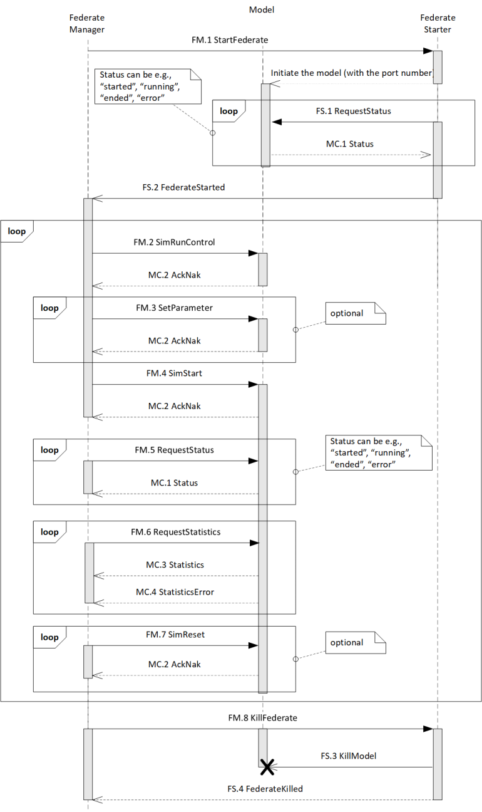

# Model Control Interaction

## Basic interaction pattern between FM, FS, and MC

The basic steps to instantiate and run a model is depicted in the following sequence diagram:

The steps are as follows:

1. The Federation Manager (FM) instructs the Federate Starter (FS) to instantiate a model with a Model Controller (MC)
2. FS instantiates MC as a process on its machine, and stores the process id to be able to end the process later
3. FS requests the status of MC to see if it has been properly initialized
4. MC answers with a status message to FS
5. FS reports to FM the model has ben properly started
6. FM sends the run control parameters (run length, warmup period, randum number generator seeds) to MC
7. MC answers with ack/nak (acknowledgement / negative acknowledgement) about the reception of the run control parameters to FM
8. FM sends model parameters for the model run (one-by-one) to MC
9. MC answers with ack/nak about the reception of the model parameters to FM
10. FM instructs MC to start the model
11. MC answers with ack/nak about the success of the start
12. FM loops to ask the status of the model to MC (has it been finished?)
13. MC answers with the status (running, stopped, finished, error, ...) to FM
14. FM sends a request to MC to send results (statistics) after the model has finished
15. MC sends results (statistics) to FM
16. Optional: FM sends a model reset to MC to bring the model into its initial state (useful for models that take very long to start)
17. Optional: MC sends ack/nak about the success of the reset, after which MC continues again at step 6
18. MC sends a message to FS to kill the model (as the FS runs on the same machine / node as the model, and it has stored the model's process id)
19. FS asks the MC to stop the model and the process
20. In case that fails, FS kills the model forcefully
21. FS reports back to FM that the model has been terminated
